# Applying Queries using Mongo DB & Cassandra. 

# First: Mongo DB
## 1. Briefly describe the movies database document model 
### Database attributes:
- _id: unique field for each file type objectId
- Awards: document type consist of 3 fields:

    o nominations: type int32

    o text: type string

    o wins: type int32

- cast: type array
- countries: type array
- directors: type array
- fullplot: type string
- genres: type array
- imdb: document type consist of 3 fields:

    o id: type int32

    o rating: type double

    o votes: type int32

- languages: type array
- metacritic: type int32
- num_mflix_comments: type int32
- plot: type string
- poster: type string
- rated: type string
- released: type string
- runtime: type string
- title: type string
- tomatoes: document type consist of 2 fields:

    o boxOffice: type string

    o consensus: type string
- type: type string
- writers: type array
- year: type int32

## 2. Filter the documents for type “movies” that are released before 1970 and rated as “PASSED” 
### Query:
{$and : [{type:"movie"}, {released :{$lt : ISODate('1970')}} , {rated:"PASSED"} ]}
The number of results: 180

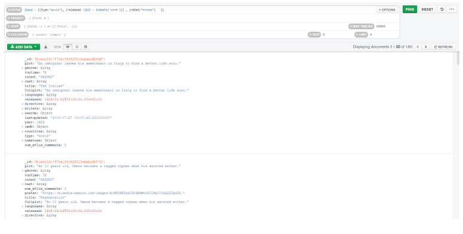

## 4. Build an Aggregation Pipeline that shows all entries of type movie that have won at least one award and return the release year aggregate counts.
- First stage

    $match
    {
    type:"movie"
    }

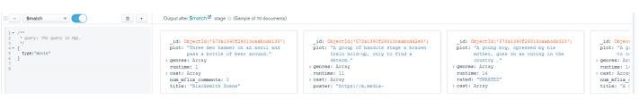

- Second stage

    $match
    {
    'awards.wins' : {$gte : 1} 
    }

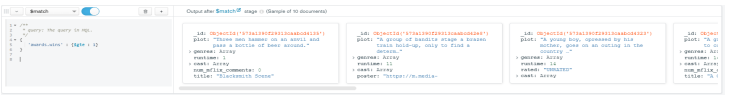
 -   Third stage

      $group
      {
      _id: "$year",
      Count: { $count: {} 
      }
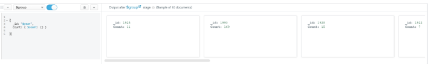

- After Running the aggregation pipeline

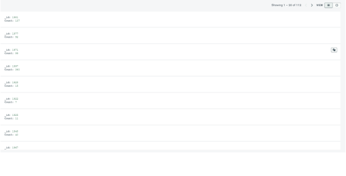

# Second: Cassandra
## Queries

• To see what is the keyspaces that we have created, we used the following commands:

    o describe keyspaces

    o describe northwind

  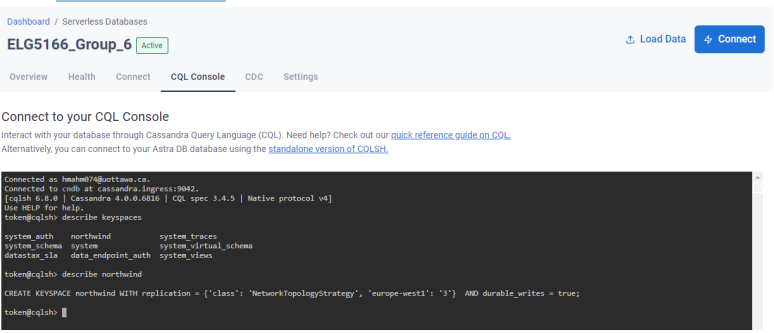
- here we have used the following commands:
    o use northwind;

    o DROP TABLE IF EXISTS Customers_By_Country;

    o CREATE TABLE Customers_By_Country

( CustomerID TEXT,

 CompanyName TEXT,

 ContactName TEXT,

 ContactTitle TEXT,

 Address TEXT,

 City TEXT,

 Region TEXT,

 PostalCode TEXT,

 Country TEXT,

 Phone TEXT,

 Fax TEXT,

 PRIMARY KEY ((Country, City), Address, CustomerID)

);
1. We have used the first command so that we don't have to write northwind each time we would 
like to create a table or drop a table.
2. And for the second command is to ensure that there is no table named “Customers_By_Country” 
in our keyspace.
3. And for the third command is to create our first table which is called “Customers_By_Country”.

 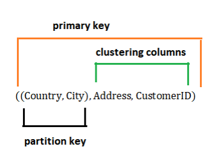

➢ here we have set “Country” as the main partition 
and “City” as a sub partition to be able to retrieve the 
required data fast, without having to use “ALLOW 
FILTERING”.

➢ And we have set “Address” as a clustering column 
to sort the customer’s addresses by their country and 
city (partition key).

➢ And also, we have set “CustomerID” as a 
clustering column to ensure that this table primary 
key’s is unique.
 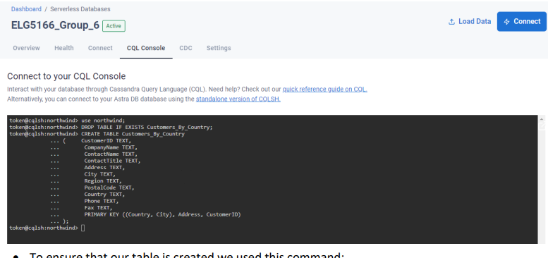

 • To ensure that our table is created we used this command:

      o Describe northwind;
 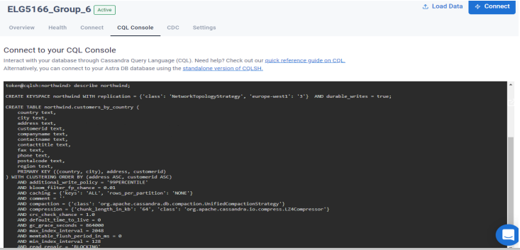

- To insert some data in that table we used commands like this:

o INSERT INTO Customers_By_Country (CustomerID, CompanyName, ContactName, 
ContactTitle, Address, City, Region, PostalCode, Country, Phone, Fax)

VALUES('ALFKI', 'Alfreds Futterkiste', 'Maria Anders', 'Sales Representative', 'Obere Str. 
57', 'Berlin', 'NS', '12209', 'Germany', '030-0074321', '030-0076545');
 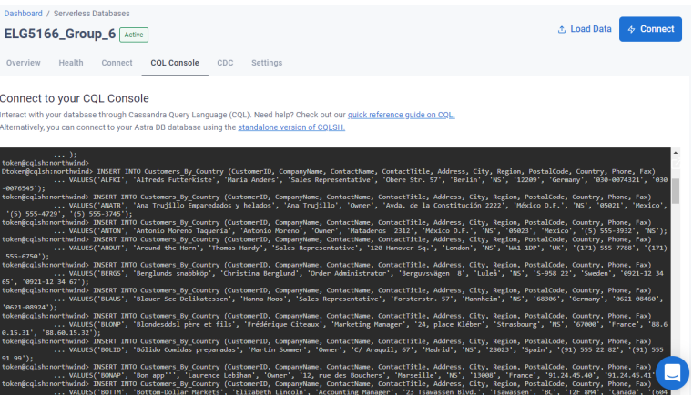

- To get the number of records in this table we have used this command:

    o SELECT COUNT(*) FROM Customers_By_Country;

   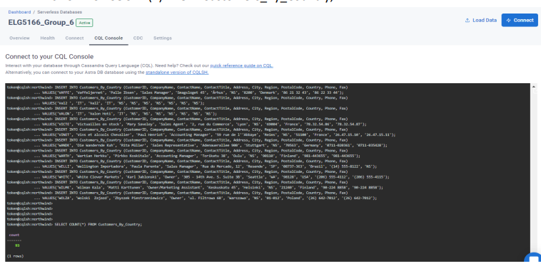

• To get the customers that are from Rio de Janeiro, Brazil, and ordered by their addresses, we 
have used this command.

    o select * from northwind.Customers_By_Country where Country = 'Brazil' and City = 
    'Rio de Janeiro';

• we did not need to use the “ALLOW FILTERING” command, because of calling the partition 
key.
   

  
